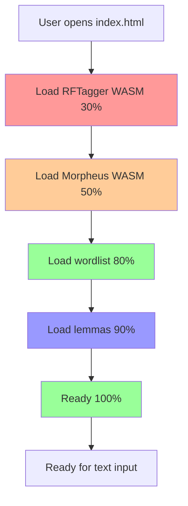

# Latin Macronizer Development Plan (Browser Port)

**Date:** 2026-05-07  
**Goal:** Complete porting and add progress bar for loading all data

---

## 1. Critical Fixes (Priority 1)

### 1.1. Fix wordlist loading
**Problem:** `macrons.txt` not loading, `wordlistUrl` not set

**Solution:**
```powershell
# Copy macrons.txt to public/
Copy-Item "latin_macronizer/macrons.txt" "public/macrons.txt"
```

In `public/api/MacronizerAPI.js` (lines 24-31):
```javascript
this.macronizer = new Macronizer({
  useWasm: true,
  enableCache: true,
  confidenceThreshold: 0.80,
  wasmModelPath: '/wasm/rftagger.js',
  morpheusWasmPath: '/wasm/cruncher.js',
  wordlistUrl: '/macrons.txt'  // ← ADD
});
```

---

## 2. Progress bar for loading all data (Priority 1)

### 2.1. Progress bar requirements:
- Show WASM module loading progress (RFTagger, Morpheus)
- Show wordlist loading progress (macrons.txt → IndexedDB)
- Show lemmas.json and endings.json loading progress
- Single progress bar with percentage

### 2.2. Changes to `index.html`:

**HTML (add after line 255):**
```html
<div class="loading" id="loading">
  <div class="loading-text">Initializing...</div>
  <div class="progress-container">
    <div class="progress-bar" id="progressBar"></div>
  </div>
  <div class="progress-details" id="progressDetails"></div>
</div>
```

**CSS (add to `<style>`):**
```css
.progress-container {
  width: 100%;
  height: 20px;
  background: #e0e0e0;
  border-radius: 10px;
  overflow: hidden;
  margin: 10px 0;
}

.progress-bar {
  height: 100%;
  background: #4CAF50;
  width: 0%;
  transition: width 0.3s;
}

.progress-details {
  font-size: 12px;
  color: #666;
  text-align: center;
}
```

**JavaScript (update `init()` function in lines 290-298):**
```javascript
async function init() {
  updateProgress(0, 'Loading RFTagger WASM...');
  try {
    await api.initialize((progress, message) => {
      updateProgress(progress, message);
    });
    initialized = true;
    document.getElementById('processBtn').disabled = false;
    updateProgress(100, 'Ready!');
    setTimeout(() => {
      document.getElementById('loading').classList.remove('show');
    }, 500);
  } catch (err) {
    showError('Failed to initialize: ' + err.message);
  }
}

function updateProgress(percent, message) {
  document.getElementById('progressBar').style.width = percent + '%';
  document.getElementById('progressDetails').textContent = message;
}
```

### 2.3. Changes to `public/api/MacronizerAPI.js`:

Update `initialize()` to support progress callback:
```javascript
async initialize(onProgress) {
  if (this.initialized) return;
  
  // Step 1: Initialize Macronizer core
  onProgress?.(10, 'Initializing core...');
  this.macronizer = new Macronizer({
    useWasm: true,
    wordlistUrl: '/macrons.txt',
    // ...
  });
  
  // Step 2: Load WASM modules
  onProgress?.(30, 'Loading RFTagger WASM...');
  await this.macronizer.initialize();
  
  // Step 3: Load wordlist
  onProgress?.(60, 'Loading wordlist...');
  // Wordlist loads inside macronizer.initialize()
  
  // Step 4: Load lemmas and patterns
  onProgress?.(80, 'Loading lemmas and patterns...');
  // Already loaded inside macronizer.initialize()
  
  onProgress?.(100, 'Ready!');
  this.initialized = true;
}
```

---

## 3. Porting Scansion (Priority 2)

### 3.1. Create `src/analysis/ScansionEngine.ts`

Port from `latin_macronizer/scansion.py`:
- `scanverses()` — main scanning function
- `scanverse()` — recursive search for best scan
- `possiblescans()` — generate possible scans
- `segmentaccented()` — syllable segmentation
- `allvowelsambiguous()` — ambiguous vowel handling

### 3.2. Create meter automata

File `src/data/meters.json`:
```json
{
  "dactylichexameter": {
    "states": [...],
    "transitions": [...]
  },
  "dactylicpentameter": {...},
  "hendecasyllable": {...}
}
```

### 3.3. Integrate with `Tokenization.ts`

Uncomment and implement in lines 756-765:
```typescript
scanVerses(meters: any): void {
  // Implement using ScansionEngine
  const engine = new ScansionEngine();
  // ...
}

get scannedFeet(): string[] {
  // Return scansion results
}
```

### 3.4. Pass `scan` option through API

In `src/api/MacronizerAPI.ts` and `public/api/MacronizerAPI.js`:
```javascript
const result = await this.macronizer.macronize(text, {
  // ...
  scan: options.scan  // ← ADD
});
```

---

## 4. Release Plan (Checklist)

- [ ] 1. Copy `macrons.txt` to `public/`
- [ ] 2. Add `wordlistUrl: '/macrons.txt'` to `MacronizerAPI.js`
- [ ] 3. Add progress bar to `index.html`
- [ ] 4. Update `MacronizerAPI.js` to support `onProgress` callback
- [ ] 5. Test all data loading
- [ ] 6. Port `scansion.py` → `ScansionEngine.ts`
- [ ] 7. Create `meters.json` with meter automata
- [ ] 8. Integrate scansion with `Tokenization.ts`
- [ ] 9. Pass `scan` option through the full API stack
- [ ] 10. Update `index.html` to display scansion results

---

## 5. File Structure After Changes

```
public/
├── index.html              # + progress bar
├── api/
│   └── MacronizerAPI.js  # + onProgress callback, + wordlistUrl
├── wasm/
│   ├── rftagger.js
│   ├── rftagger.wasm
│   ├── cruncher.js
│   ├── cruncher.wasm
│   └── *.model, *.data
└── macrons.txt             # ← COPY

src/
├── analysis/
│   ├── ScansionEngine.ts  # ← CREATE (port scansion.py)
│   ├── MorpheusAnalyzer.ts
│   ├── WasmTagger.ts
│   └── ...
├── core/
│   ├── Macronizer.ts
│   ├── Tokenization.ts    # + scanVerses() implementation
│   └── ...
└── data/
    ├── meters.json       # ← CREATE (meter automata)
    ├── lemmas.json
    └── endings.json
```

---

## 6. Mermaid loading progress diagram



---

**End of plan**
